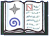

# SlateStarCodex


Extract posts from http://slatestarcodex.com/ and render them as a PDF.

## Why?

I wanted to read SlateStarCodex on my Kindle.

## Usage

```bash
node cli.js download
node cli.js render
# PDF is stored in the data/ folder
```
## Notes

Note that this program is deliberatly slow. The blog's [robots.txt](http://slatestarcodex.com/robots.txt) doesn't specifiy a rate-limit, but I  don't want to accidentally DOS the site. All downloads run sequentially, and a local copy of posts is maintained in a database.

I don't own any of the content this program extracts, nor the logo `codex.png`; these belong to Scott Alexander of http://slatestarcodex.com/.

The styling roughly follows the [following guide](https://ux.stackexchange.com/a/3623). Feel free to send PRs to improve this stylesheet.

This project will be kept in a working state, but no enhancements are planned.

## License

MIT License

Copyright (c) 2018 Ryan Grannell

Permission is hereby granted, free of charge, to any person obtaining a copy
of this software and associated documentation files (the "Software"), to deal
in the Software without restriction, including without limitation the rights
to use, copy, modify, merge, publish, distribute, sublicense, and/or sell
copies of the Software, and to permit persons to whom the Software i
furnished to do so, subject to the following conditions:

The above copyright notice and this permission notice shall be included in all
copies or substantial portions of the Software.

THE SOFTWARE IS PROVIDED "AS IS", WITHOUT WARRANTY OF ANY KIND, EXPRESS OR
IMPLIED, INCLUDING BUT NOT LIMITED TO THE WARRANTIES OF MERCHANTABILITY,
FITNESS FOR A PARTICULAR PURPOSE AND NONINFRINGEMENT. IN NO EVENT SHALL THE
AUTHORS OR COPYRIGHT HOLDERS BE LIABLE FOR ANY CLAIM, DAMAGES OR OTHER
LIABILITY, WHETHER IN AN ACTION OF CONTRACT, TORT OR OTHERWISE, ARISING FROM,
OUT OF OR IN CONNECTION WITH THE SOFTWARE OR THE USE OR OTHER DEALINGS IN THE
SOFTWARE.
