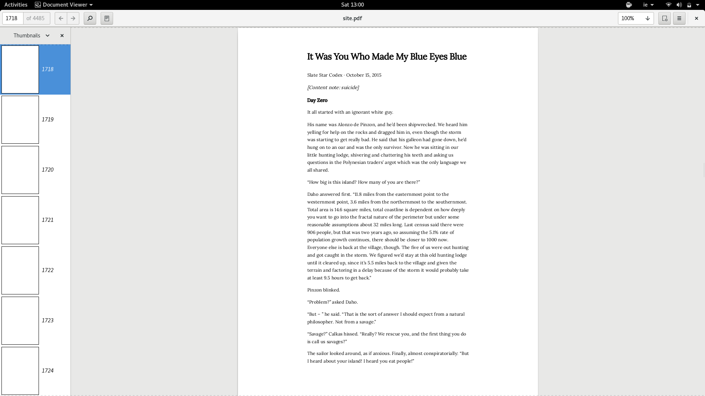

# SlateStarCodex



Extract posts from http://slatestarcodex.com/ and render them as a PDF.

## Why?

SlateStarCodex is an excellent blog, and I like to read it on my Kindle. I don't find the site itself that readable, and given that the blog is a collection of essay's it makes sense to compile it into book-format.  

## Usage

```bash
node cli.js download
node cli.js render
# PDF is stored in the data/ folder
```
## Notes 

Note that this program runs slowly, deliberatly. The blog's [robots.txt](http://slatestarcodex.com/robots.txt) doesn't specifiy a rate-limit, but I  don't want to accidentally DOS the site. All downloads run sequentially, and a local copy of posts is maintained in a database.

I don't own any of the content this program extracts; again, these belong to Scott Alexander of http://slatestarcodex.com/.
